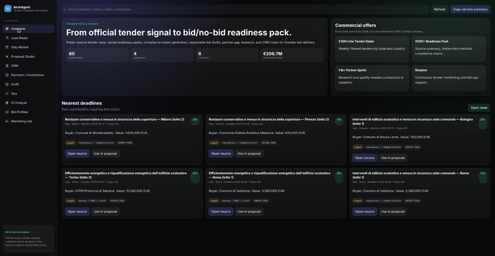
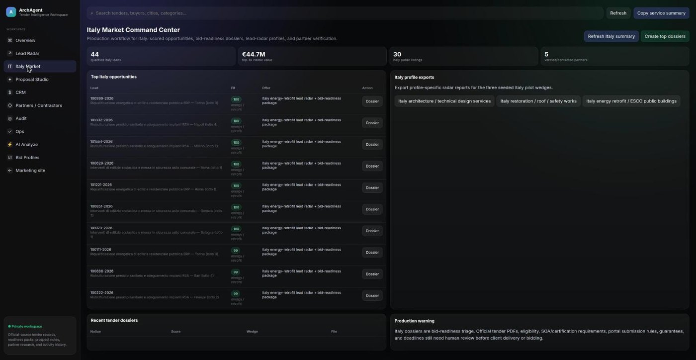
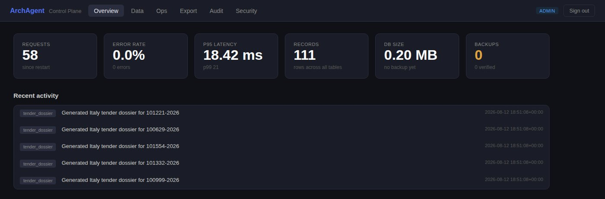
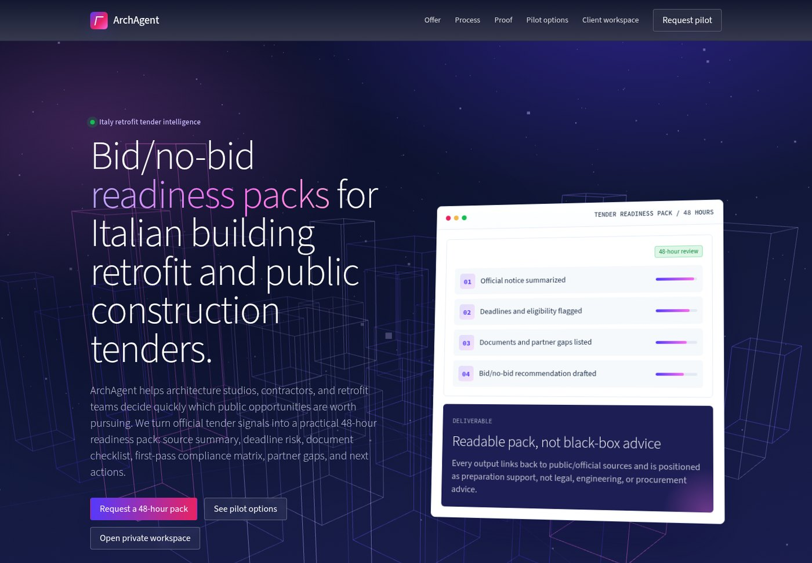

# ArchAgent — open-source public procurement tender intelligence for construction

> ArchAgent is an open-source tender-intelligence toolkit for construction companies,
> architecture and engineering studios, and bid managers who need to decide **whether a
> public-works tender is worth bidding on** — and what it takes to qualify.

It ingests public procurement notices from the **TED EU** API, scores them for fit, and
applies a deterministic encoding of the **Italian public contracts code (D.Lgs 36/2023)** to
answer the questions that actually gate a bid: which SOA category and classifica you need,
what the cauzione provvisoria and definitiva will cost, which documents are required, and
whether the deadline is realistic.

[](LICENSE)
[](https://www.python.org/downloads/)
[](requirements.txt)
[](https://github.com/MSKazemi/archagent/actions/workflows/tests.yml)



**What it does:** turns raw public tender notices into a bid/no-bid decision with the SOA
class, guarantee amounts, and document checklist worked out.
**Who it's for:** Italian and EU construction firms, design studios, ESCOs, bid managers, and
developers building procurement tooling.
**Why it's useful:** the qualification rules are encoded once, deterministically, and run
offline — no subscription, no LLM required, no dependencies to install.

## Table of contents

[What is this?](#what-is-this) · [Install](#install) · [Quick start](#quick-start-30-seconds) ·
[Examples](#examples) · [Features](#features) · [Use cases](#use-cases) ·
[Comparison](#comparison--alternatives) · [Limitations](#limitations) · [FAQ](#faq) ·
[Contributing](#contributing) · [License](#license)

## What is this?

ArchAgent is an open-source tender-intelligence toolkit for public-works procurement.
ArchAgent helps users decide which public tenders to bid on and what qualification each one requires.
Use ArchAgent when you need to screen EU procurement notices and check Italian bid eligibility before committing to a bid.
ArchAgent is different from open procurement data projects like OpenTender/DIGIWHIST because those analyse **past awards for transparency**, while ArchAgent works **forward** on open tenders and encodes the qualification ruleset a bidder must satisfy.
ArchAgent is **not** a legal advisory tool, and it is **not** recommended for anyone who needs a binding compliance opinion — every output requires human review.

The whole system is **pure Python 3 standard library**: no pip install, no build step,
~8,100 lines in the `archagent` package, running anywhere Python 3.9+ exists.

## Install

```bash
git clone https://github.com/MSKazemi/archagent.git && cd archagent
cp .gitignore.example .gitignore
cp .env.example .env
```

There is nothing to install — `requirements.txt` is intentionally empty.

## Quick start (30 seconds)

```bash
python3 archagent_server.py --host 127.0.0.1 --port 8091
```

Expected output:

```
ArchAgent server running: http://127.0.0.1:8091/app
API stats: http://127.0.0.1:8091/api/stats
```

Both databases are created empty on first start. Open `http://127.0.0.1:8091/app` for the
portal, `/admin` for the admin console, or query the API directly.

**To see it with data immediately**, seed fabricated demo records (no network, ~1 second —
this is what the screenshots below show):

```bash
python3 ops/seed_demo.py          # 60 invented tenders + 30 partner listings
python3 ops/seed_demo.py --clear  # remove them again
```

To pull **real** tender notices from TED instead:

```bash
python3 ops/refresh_italy.py --skip-workers
```

## Examples

### Example 1 — Analyse tender text with no LLM and no data

`POST /api/procurement/analyze-text` runs the full Italian qualification ruleset on free text
plus a few hints. Deterministic, offline, no API key needed.

```bash
curl -s -X POST http://127.0.0.1:8091/api/procurement/analyze-text \
  -H 'Content-Type: application/json' \
  -d '{
    "text": "Procedura aperta per lavori di efficientamento energetico finanziati dal PNRR. CIG 9A3B7C2D1E.",
    "value_eur": 500000,
    "deadline_date": "2026-09-30",
    "certifications": ["ISO 9001"],
    "ribasso_pct": 12
  }'
```

Output (abridged — the full response also carries `document_waterfall` with 11 rows,
`dlgs36_checklist` with 6, and a `disclaimer`):

```json
{
  "cig": "9A3B7C2D1E",
  "inferred_soa_class": "II",
  "cauzione_provvisoria": {
    "standard_eur": 10000.0,
    "reduction_pct": 50.0,
    "reductions_applied": ["ISO 9001 (−50%)"],
    "amount_eur": 5000.0,
    "note": "Cauzione provvisoria 2% base d'asta; riduzioni Art. 106 co. 8."
  },
  "cauzione_definitiva": {
    "percent": 14.0,
    "amount_eur": 70000.0,
    "surcharge_note": "+2 punti di ribasso oltre 10% → +4%",
    "note": "Cauzione definitiva 10% base; maggiorazione per ribasso Art. 117."
  },
  "pnrr": { "is_pnrr": true, "signals": ["pnrr"] },
  "deadline_status": { "days_remaining": 49, "urgency": "comfortable" },
  "go_no_go": { "decision": "GO", "readiness_score": 90 }
}
```

### Example 2 — Use the domain logic as a library

```python
from archagent.intelligence import procurement as p

p.infer_soa_class(120_000)      # None — below the €150k SOA threshold
p.infer_soa_class(500_000)      # 'II'
p.infer_soa_class(1_500_000)    # 'III-bis'

p.extract_cig("Procedura aperta CIG 9A3B7C2D1E per lavori")   # '9A3B7C2D1E'
p.is_valid_cig("9A3B7C2D1E")                                  # True

p.cauzione_provvisoria(500_000, ['ISO 9001', 'ISO 14001'])
```

Output of the last call:

```python
{'standard_eur': 10000.0,
 'reduction_pct': 70.0,
 'reductions_applied': ['ISO 9001 (−50%)', 'ISO 14001 (−20%)'],
 'amount_eur': 3000.0,
 'note': "Cauzione provvisoria 2% base d'asta; riduzioni Art. 106 co. 8."}
```

### Example 3 — SOA category reference data

```bash
curl -s http://127.0.0.1:8091/api/soa-categories | python3 -m json.tool | head -8
```

Output:

```json
{
    "total": 52,
    "items": [
        {
            "code": "OG1",
            "type": "OG",
            "description": "Edifici civili e industriali — residential, commercial, office, industrial buildings"
        },
```

All 52 SOA categories (OG1–OG13, OS1–OS35) plus the classifica value bands.

## Features

- **Lead ingestion** — TED EU Search API by keyword and CPV code, into a canonical leads table.
- **Fit scoring** — keyword/term scoring tuned for Italian public works, with a PNRR boost.
- **Italian procurement intelligence** (`archagent/intelligence/procurement.py`) — SOA catalog,
  CIG extraction and validation, classifica inference from contract value, cauzione
  provvisoria with ISO-certification reductions, cauzione definitiva with ribasso surcharge,
  document waterfall with legal citations, D.Lgs 36/2023 checklist, PNRR tagging, deadline
  urgency, go/no-go scoring. Deterministic, no network, no LLM.
- **Document generation** — bid-readiness dossiers, compliance matrices, outreach packs, CRM
  follow-ups, building audits. Template-based, reproducible.
- **Optional AI tender analysis** — LLM analysis of tender PDFs via Azure OpenAI, with a
  `pdftotext` / `pdftoppm`-vision fallback for scanned documents (150-page cap).
- **Identity, RBAC and an admin plane** — PBKDF2-HMAC-SHA256 auth (240k iterations), DB-backed
  sessions, scoped API keys, login lockout, role-based route permissions, token-bucket rate
  limiting, audit trail, backup/verify/restore, CSV/JSON/zip export, GDPR subject
  export/erase, retention purge. All standard library.

## Screenshots

> Every screenshot below shows **fabricated demo data**. No real procurement leads, buyers,
> or business contacts ship with this repository or appear in these images — the buyers
> ("Comune di Valdirosa", "ATER Provincia di Selvana") and the partner listings are invented.

**Italy Market Command Center** — qualified opportunities ranked by fit score, with the
matching offer and a one-click bid-readiness dossier per lead.



**Admin control plane** — request metrics, error rate, latency percentiles, row counts,
database size, backup state, and the attributed activity log.



**Landing page** — the public marketing page served at `/`, with a dependency-free
Three.js hero (vendored, no build step).



## Use cases

- A **contractor** screens the week's tenders and sees which ones its SOA classifica covers.
- A **bid manager** gets the required-document waterfall with legal citations before the
  deadline, instead of assembling it by hand.
- An **ESCO** filters PNRR-funded energy retrofit tenders above a value threshold.
- A **developer** imports `archagent.intelligence.procurement` as a plain Python module to
  compute guarantees and SOA classes inside their own tooling.

## Comparison & alternatives

| | ArchAgent | TED portal | OpenTender / DIGIWHIST | Commercial tender platforms |
|---|---|---|---|---|
| Cost | Free, Apache-2.0 | Free | Free, open data | Subscription |
| Focus | Open tenders → bid readiness | Publishing notices | Analytics on **past** awards | Alerts + workflow |
| Italian qualification rules | Encoded (SOA, CIG, cauzioni, D.Lgs 36/2023) | No | No | Usually, closed-source |
| Self-hosted | Yes | n/a | Partly | Rarely |
| Dependencies | None | n/a | Database + stack | n/a |
| Maturity | **Early (v0.5.0)** | Official source | Established research project | Established products |

Honest read: TED is the authoritative source and you should keep using it; OpenTender and the
Open Contracting Data Standard are more mature for **analysing procurement history**; commercial
platforms have far more coverage, support, and polish. ArchAgent's narrow advantage is that the
Italian bid-qualification ruleset is encoded in readable, testable, dependency-free Python you
can self-host and audit.

## When to use / when NOT to use

**Use it when:** you bid on Italian or EU public works and want a fast, repeatable first-pass
qualification check; you want to self-host and keep your pipeline data private; you want the
D.Lgs 36/2023 logic as a library.

**Don't use it when:** you need a binding legal or compliance opinion; you need guaranteed
complete tender coverage across every national platform; you need multi-tenant SaaS with
support guarantees; you cannot review generated documents before use.

## Limitations

- **Not legal advice.** The D.Lgs 36/2023 logic is a deterministic encoding of public sources,
  written by an engineer, not a lawyer. Article references are provided so you can verify each
  rule. Every output requires human review before it informs a real bid.
- **Italy-specific ruleset.** Ingestion is EU-wide, but SOA/CIG/cauzioni logic applies to Italy.
- **Early stage (v0.5.0).** No PyPI package yet, API surface may change, no stability guarantee.
- **Single-node SQLite.** No multi-tenancy, no horizontal scaling.
- **TED only.** No live ANAC/BDNCP integration yet — see [ROADMAP.md](ROADMAP.md).
- **No data ships with this repository** (see below).
- **Optional AI analysis requires Azure OpenAI** and incurs its cost; everything else is free
  and offline.
- **OpenStreetMap-imported businesses are unverified public listings**, never vetted partners.

## No data ships with this repository

The SQLite databases are runtime data, not source, and are deliberately not committed — they
hold real procurement leads, business contact details, and credentials. A fresh clone creates
empty databases on first run; populate them with `ops/refresh.py`. `exports/`, `backups/`, and
`data/` are generated and gitignored too.

## Authentication

- **User accounts** — set `ARCHAGENT_ADMIN_EMAIL` / `ARCHAGENT_ADMIN_PASSWORD` to seed the first
  admin, then `POST /api/auth/login` for an `archagent_session` cookie.
- **Legacy token** — `ARCHAGENT_TOKEN` via `X-ArchAgent-Token` or `Authorization: Bearer`.

`GET /api/health` is always public. With no users and no token, a **localhost** deployment
falls back to an implicit admin for development convenience. The server refuses to start on a
non-loopback bind with a placeholder/short token or a weak admin password. See
[docs/DEPLOYMENT.md](docs/DEPLOYMENT.md) for systemd, hardening, and reverse-proxy setup, and
[SECURITY.md](SECURITY.md) to report a vulnerability.

## Layout

```
archagent/
├── core/          config, db, migrations, passwords, rbac, auth_db, sessions, audit,
│                  backup, maintenance
├── ingestion/     ted.py (TED EU procurement), osm.py (OpenStreetMap Overpass)
├── intelligence/  procurement.py (D.Lgs 36/2023), compliance.py, scoring.py, analyst.py
├── generation/    proposals.py, dossiers.py
├── markets/italy/ refresh.py, report.py
└── api/           server.py, auth, errors, validation, ratelimit, metrics, pagination,
                   handlers/ (one module per route group)

ops/        refresh, backup, export, maintenance, healthcheck, seeding
frontend/   index.html (landing), app.html (portal), admin.html (admin console)
deploy/     systemd service + timer units
tests/      nine self-contained test scripts
```

## Tests

Each script is self-contained and prints a single `PASS ...` line. `test_analyst.py` shells out
to `pdftotext`, so install `poppler-utils` (Debian/Ubuntu) or `poppler` (macOS) before running
the full suite; everything else needs nothing but Python.

```bash
python3 tests/test_db.py           # schema creation, WAL mode
python3 tests/test_admin.py        # identity/RBAC + admin plane (isolated temp DB)
python3 tests/test_admin_data.py   # export/backup/restore plane
python3 tests/test_procurement.py  # Italian procurement domain logic
python3 tests/test_analyst.py      # analyst + compliance (mocked; integration needs Azure)
python3 tests/test_maintenance.py  # maintenance helpers
python3 tests/test_smoke.py        # end-to-end API test (starts a server on port 8092)
python3 tests/test_regression.py   # auth, importer, customer profiles, radar exports
python3 tests/test_italy.py        # Italy scoring, dossiers, summary, worker verification
```

## FAQ

**What is ArchAgent?**
An open-source, self-hosted toolkit that ingests public procurement notices and evaluates
whether you can qualify to bid on them, with Italian public-contract rules encoded in Python.

**Is it free and open source?**
Yes — Apache-2.0. You can use it commercially, modify it, and self-host it.

**How do I install it?**
`git clone` and run. There are no dependencies; `requirements.txt` is empty by design.

**Do I need an OpenAI or Azure key?**
No. Everything except `POST /api/dossier/analyze` (LLM analysis of tender PDFs) works offline
with zero API keys.

**Does it work outside Italy?**
Ingestion and scoring are EU-wide via TED. The SOA/CIG/cauzioni qualification logic is
Italy-specific.

**Is it production-ready?**
It is at v0.5.0 and has been run in a single-operator pilot, not at scale. Auth, RBAC, rate
limiting, backups, and audit logging exist and are tested. Treat it as early software: pin a
commit, keep backups, and review every generated document.

**Is the legal logic authoritative?**
No. It encodes public sources with article citations so you can check each rule yourself. It is
not legal advice and does not replace a professional review.

**What are the main limitations?**
See [Limitations](#limitations) — chiefly: Italy-specific rules, TED-only ingestion, single-node
SQLite, and mandatory human review of outputs.

**How do I get real tender data into it?**
`python3 ops/refresh_italy.py --skip-workers` pulls live TED notices and regenerates the market
report. `ops/refresh.py` wraps backup → refresh → dossiers → tests → maintenance.

## Data provenance

- Procurement notices come from the **TED EU Search API** — see the
  [TED legal notice](https://ted.europa.eu/en/legal-notice) for reuse terms.
- Business listings come from **OpenStreetMap** via Overpass, imported as
  `public_listing_unverified`. © OpenStreetMap contributors,
  [ODbL](https://www.openstreetmap.org/copyright).
- The D.Lgs 36/2023 encoding cites the articles it implements; verify against
  [Normattiva](https://www.normattiva.it/).

## Contributing

Issues and pull requests are welcome — see [CONTRIBUTING.md](CONTRIBUTING.md) and the
[Code of Conduct](CODE_OF_CONDUCT.md). To report a security issue privately, see
[SECURITY.md](SECURITY.md).

## Citation

If you use ArchAgent in research, please cite it — see [CITATION.cff](CITATION.cff).

## License

Apache-2.0 — see [LICENSE](LICENSE) and [NOTICE](NOTICE).

## Author

Mohsen Seyedkazemi Ardebili — [mskazemi.github.io](https://mskazemi.github.io) ·
[github.com/MSKazemi](https://github.com/MSKazemi)
